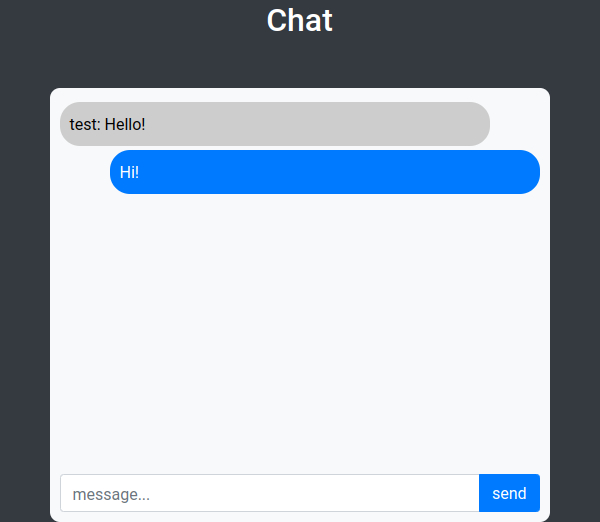

# PHP/SQLite chat design

I created this repository a long time ago, I have very little knowledge of php.

## Screenshots



## Links

- Source code: [Github](https://github.com/salif/chat)
- Source code: [Codeberg](https://codeberg.org/salif/chat)

## Run

```bash
git clone https://github.com/salif/chat.git
cd chat
sqlite3 chat/db/main.db < chat/db/main.db.sql
php -S localhost:8080
```

Go to http://localhost:8080
